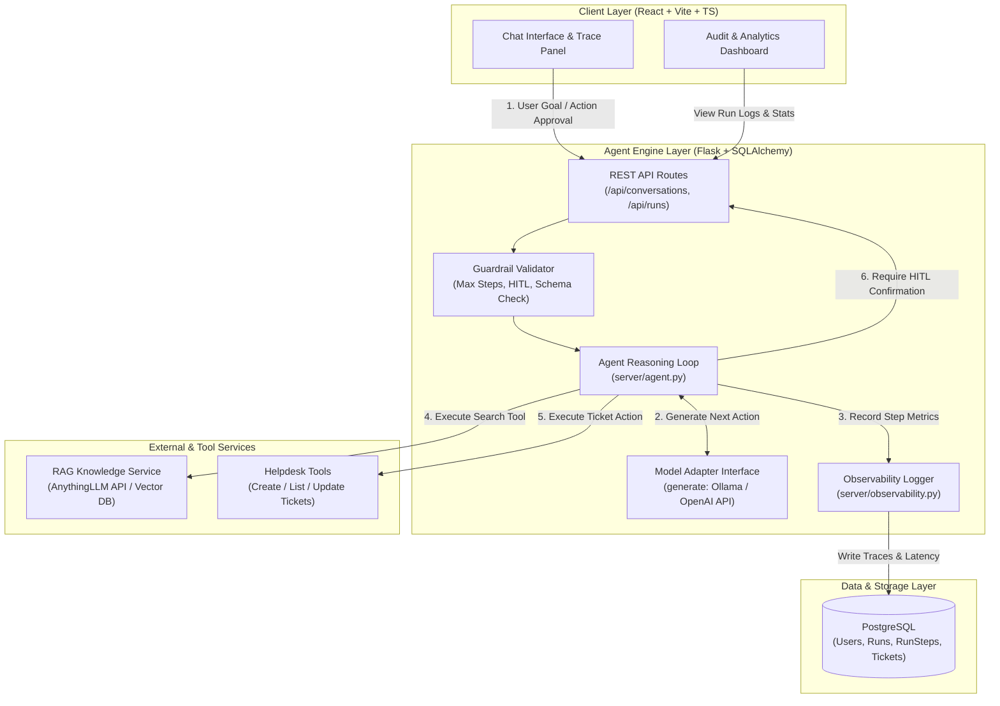

# Enterprise Support Triage Agent & RAG Knowledge Service

[](https://github.com/freeleons/RAG-Agentic-Project/actions)
[](https://python.org)
[](https://flask.palletsprojects.com/)
[](https://react.dev/)
[](https://www.postgresql.org/)
[](./LICENSE)

> A production-grade **Autonomous AI Support Triage Agent** built with Python/Flask and React (TypeScript). Features a custom **bounded reasoning loop**, **Human-in-the-Loop (HITL) execution safety**, **prompt injection defense**, an integrated **RAG vector knowledge service** (AnythingLLM API), and comprehensive **per-step system observability & analytics**.

---

## 🎥 Demos & Visual Showcase

<!-- PLACEHOLDER: 60-Second Video Demo / GIF -->
<!-- Recommend placing a 60-second video demo or GIF here showing the live agent loop, step trace panel, and HITL confirmation modal -->
> [!NOTE]
> **Live Interactive Demo:** [https://agent-demo.example.com](https://agent-demo.example.com)  *(Replace with live deployment link)*
> **1-Minute Loom Walkthrough:** [Watch Video Demo](https://loom.com/share/placeholder)

### 📸 UI Screenshots

<div align="center">

<!-- PLACEHOLDER: Main Chat Interface & Agent Trace Panel -->
<!--
  IMAGE REQUIREMENT: Upload screenshot of Chat Interface with open Agent Trace Panel showing step-by-step reasoning.
  File path: docs/images/chat-trace-screenshot.png
-->
> **Chat Interface & Real-time Agent Trace Panel**
>
> *(Place screenshot `chat-trace-screenshot.png` here: Shows user goal, step-by-step tool execution, latency, and reasoning trace)*
>
> ``

<br/>

<!-- PLACEHOLDER: Observability & Audit Dashboard -->
<!--
  IMAGE REQUIREMENT: Upload screenshot of Audit Dashboard showing token metrics, latency charts, and run filters.
  File path: docs/images/audit-dashboard-screenshot.png
-->
> **System Observability & Audit Analytics Dashboard**
>
> *(Place screenshot `audit-dashboard-screenshot.png` here: Shows run stats, token consumption, latency breakdowns, and admin audit trail)*
>
> ``

</div>

---

## 🏗️ System Architecture

The application is architected as two decoupled systems: a **RAG Knowledge Service** and a **Bounded Agent Backend** with an interactive **React UI**.



---

## 🌟 Key Engineering Highlights

### 1. Custom Bounded Agent Loop (No Framework Lock-in)
* Built from first principles in `server/agent.py` without heavy black-box frameworks (e.g. LangChain / AutoGen).
* Implements a deterministic `Decide → Act → Observe → Repeat` loop bounded by strict step caps (`MAX_AGENT_STEPS`).
* Delivers complete transparency and fine-grained control over model prompts, execution flow, and state transitions.

### 2. Production Guardrails & Human-in-the-Loop (HITL)
* **Consequential Action Safety:** Any action marked with `requires_confirmation` (e.g., ticket creation or escalation) automatically halts the agent loop and enters a `needs_confirmation` state.
* **State Resumption:** User approvals or rejections are stored as `PendingAction` records, allowing the loop to cleanly resume or gracefully pivot based on user decision.
* **Argument Validation & Retry:** Malformed tool arguments are validated against schemas (`server/tools/`); the agent receives a specific correction feedback message with a 1-retry cap before failing safely.

### 3. Enterprise Observability & Auditability
* **Per-Step Metrics:** Decorator-driven telemetry (`server/observability.py`) records prompt tokens, completion tokens, execution latency (ms), tool arguments, and raw LLM message histories into PostgreSQL (`RunStep` model).
* **Audit Dashboard:** Full React analytical view showing token consumption trends, average step latencies, run failure rates, and admin inspection tools.

### 4. Enterprise Knowledge RAG Integration
* Decoupled vector retrieval via AnythingLLM API behind a clean `search_knowledge(query)` abstraction.
* Protects the core agent engine from vector database vendor lock-in.

---

## 🛡️ AI Safety & Prompt Injection Protection

| Defense Mechanism | Implementation Strategy |
| :--- | :--- |
| **Data/Instruction Boundary** | Tool responses are wrapped inside `<tool_result>` XML tags. System prompts instruct the LLM to treat content within these boundaries purely as untrusted data. |
| **Bounded Step Limit** | Enforces `MAX_AGENT_STEPS` (default: 6) to prevent infinite loops, hallucinated recursion, or API cost overruns. |
| **Tool Timeout Safety** | Tool invocations execute with explicit timeout limits (`TOOL_TIMEOUT_SECONDS`). |
| **Scoped Auth Permissions** | Multi-tenant user session authentication; users can only access their own conversations, runs, and tickets. |

---

## 🛠️ Tech Stack

| Layer | Technology | Primary Role |
| :--- | :--- | :--- |
| **Frontend** | React 18, TypeScript, Vite, TailwindCSS | Chat UI, real-time agent trace visualization, audit dashboard |
| **Backend** | Python 3.11+, Flask, SQLAlchemy | Agent reasoning loop, tool router, state management, REST endpoints |
| **Database** | PostgreSQL 16 / SQLite | Persistence for users, sessions, runs, observability steps, and tickets |
| **LLM Provider** | Ollama (`llama3.1:8b`) / OpenAI API | Tool-calling reasoning engine (swappable via `llm.py` adapter) |
| **Knowledge Service** | AnythingLLM (Docker) | Vector index, document retrieval & RAG API service |
| **Testing & CI** | Pytest, Vitest, GitHub Actions | Automated unit/integration testing on every PR |

---

## 🚀 Quick Start & Installation

### Prerequisites
* **Docker** (for AnythingLLM & Postgres)
* **Python 3.11+** & `venv`
* **Node.js 18+** & `npm`
* **Ollama** (for local model inference)

### 1. Start the RAG Knowledge Service & Database
```bash
# 1. Spin up AnythingLLM RAG Service (Port 3001)
docker run -d -p 3001:3001 \
  -e STORAGE_DIR="/app/server/storage" \
  -v anythingllm_storage:/app/server/storage \
  --name anythingllm mintplexlabs/anythingllm

# 2. Spin up PostgreSQL DB (Port 5432)
docker run -d -p 5432:5432 \
  -e POSTGRES_PASSWORD=agent \
  -e POSTGRES_DB=agentdb \
  -v agentdb_data:/var/lib/postgresql/data \
  --name agentdb postgres:16
```

### 2. Configure Environment & Model
```bash
# Pull local reasoning model via Ollama
ollama serve
ollama pull llama3.1:8b

# Copy environment template
cp .env.example .env
# Edit .env with your ANYTHINGLLM_API_KEY and DATABASE_URL
```

### 3. Backend Setup (Flask API)
```bash
# Create and activate virtual environment
python -m venv .venv
source .venv/bin/activate

# Install dependencies
pip install -r server/requirements.txt

# Run database migrations & start backend server (Port 5000)
flask --app server.app db upgrade
flask --app server.app run --debug
```

### 4. Frontend Setup (React App)
```bash
cd client
npm install
npm run dev # Launches at http://localhost:5173
```

---

## 🧪 Testing & CI/CD Pipeline

The project enforces strict testing standards with automated CI checking on every pull request.

```bash
# Run backend test suite (Pytest)
python -m pytest server/tests -v

# Run single test module
python -m pytest server/tests/test_agent.py -v

# Run frontend test suite (Vitest)
cd client
npm test -- --run
```

### CI Pipeline Features (`.github/workflows/ci.yml`)
* Automated Python & Node.js environment setups.
* Parallel test execution for backend (`pytest`) and frontend (`vitest`).
* Production build verification (`npm run build`).

---

## 📁 Repository Structure

```
.
├── .github/workflows/   # GitHub Actions CI/CD pipelines
├── client/              # React (Vite + TypeScript) Frontend
│   ├── src/
│   │   ├── audit/       # Analytics dashboard & run metrics components
│   │   ├── auth/        # Login/register modals & auth context
│   │   ├── chat/        # Main chat interface & prompt starters
│   │   ├── tickets/     # Helpdesk ticket management views
│   │   └── trace/       # Real-time agent step trace panel
├── server/              # Flask Backend & Agent Core
│   ├── agent.py         # Bounded reasoning loop & HITL engine
│   ├── llm.py           # Unified model generator adapter
│   ├── models.py        # SQLAlchemy schema (User, Run, RunStep, Ticket)
│   ├── observability.py # Telemetry decorator for latency/token tracking
│   ├── routes.py        # REST API endpoints & admin audit routes
│   ├── tools/           # Modular tool definitions (RAG search, tickets)
│   └── tests/           # Unit & integration pytest suite
├── docs/                # Design specifications, specs, and architecture docs
└── sample-data/         # Knowledge base document samples for RAG seeding
```

---

## 📄 License & Contact

This project is licensed under the **MIT License**.

Designed & built by **Apprentice Team / Developer** as a demonstration of production AI systems engineering.

* **Email:** developer@example.com *(Replace with your email)*
* **LinkedIn:** [linkedin.com/in/yourprofile](https://linkedin.com/in/yourprofile) *(Replace with your profile)*
* **Portfolio:** [yourportfolio.dev](https://yourportfolio.dev) *(Replace with your portfolio)*
