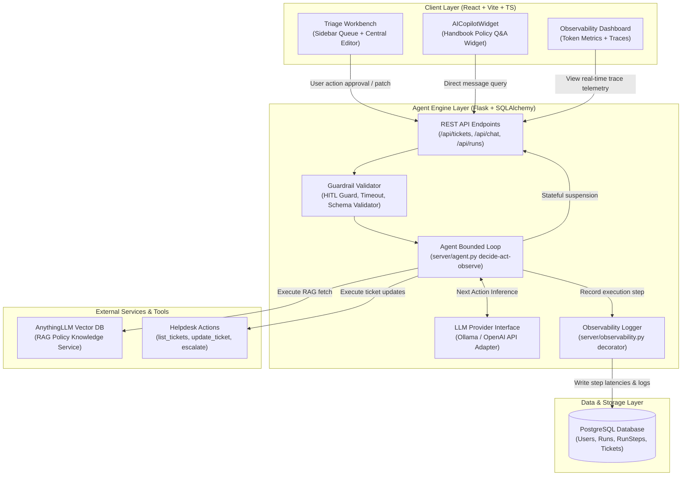

# ApexCare: Enterprise Support Triage Agent & RAG Knowledge Service

[](https://github.com/freeleons/RAG-Agentic-Project/actions)
[](https://python.org)
[](https://flask.palletsprojects.com/)
[](https://react.dev/)
[](https://www.postgresql.org/)
[](./LICENSE)

> **ApexCare** is a production-grade, multi-tenant **Autonomous AI Support Triage Agent** and **RAG Knowledge Service** designed to assist enterprise HR and IT operations. Built from first principles using Python/Flask and React (TypeScript), it implements a customized **bounded reasoning loop**, **stateful Human-in-the-Loop (HITL) execution safety**, **prompt injection defense boundaries**, and a decorator-driven **observability & analytics system** to deliver auditability at scale.

---

## 🎥 Demos & Visual Showcase

> [!TIP]
> **Core Concept:** Rather than leaving the support specialist in a generic chat interface, ApexCare introduces a unified **Ticket Triage Workbench** dashboard. The agent acts as an embedded assistant directly grounding replies with policy retrieval, compiling draft responses, and routing escalations, with every reasoning step audited and trace-logged.

### 📸 Triage Workbench Interface
<div align="center">
  
  <p><i>The central Triage Workbench view with live sidebar tickets, active workbench details, and the collapsible AI Copilot widget on the right.</i></p>
</div>

### 📸 System Analytics & Observability Dashboard
<div align="center">
  
  <p><i>The Admin Observability panel displaying token consumption trends, average step latencies, failure rates, and step-by-step telemetry traces.</i></p>
</div>

---

## 🏗️ System Architecture

The application is structured into decoupled, stateless service layers backed by a PostgreSQL database and connected to AnythingLLM via a REST vector index connector:



---

## 🌟 Key Engineering Highlights

### 1. Custom Bounded Agent Loop (No Framework Lock-in)
* **First-Principles Design:** Built directly in [`server/agent.py`](file:///Users/daniel/code/flatiron/RAG-Agentic-Project/server/agent.py) without heavy black-box orchestrators (e.g. LangChain or AutoGen) to ensure complete transparency.
* **Deterministic Bounds:** Governed by strict step limits (`MAX_AGENT_STEPS = 6`) and tool timeouts (`TOOL_TIMEOUT_SECONDS = 30`) to prevent runaway recursive reasoning loops, hallucinated cycles, or API cost overruns.
* **Schema Validation & Self-Correction:** Model tool calls are checked against JSON schemas before execution. Schema mismatches trigger a structured error response back to the agent with a 1-retry self-correction cap.

### 2. Human-in-the-Loop (HITL) Execution Safety
* **Consequential Actions Guarded:** Critical actions (like writing ticket drafts or routing escalations) are marked as `requires_confirmation = True`. 
* **Stateful Resumption:** On identifying a consequential action, the loop halts, saves its state to database logs as a `PendingAction`, and enters a `needs_confirmation` status. It resumes cleanly once the support specialist clicks approve or reject in the UI.

### 3. Decoupled RAG Knowledge Integration
* Implements a vector-index retrieval query via AnythingLLM API behind a clean `search_knowledge` tool interface. This decouples the core reasoning engine from vendor-specific vector store architectures.

### 4. Telemetry & Analytics Dashboard
* **Decorator Telemetry:** Logging decorators in [`server/observability.py`](file:///Users/daniel/code/flatiron/RAG-Agentic-Project/server/observability.py) capture completion/prompt tokens, model info, execution latency (in milliseconds), tool parameters, and raw JSON logs.
* **Analytical UI:** The Audit Dashboard visualizes token volume trends, failure statistics, trace trees, and latency buckets (20%, 50%, 90% latency percentiles).

---

## 🛡️ AI Safety & Prompt Injection Protection

| Protection Layer | Strategy |
| :--- | :--- |
| **XML Data Isolation** | Retrieval and tool responses are wrapped inside `<tool_result>` XML tags. The system prompt instructs the agent to treat this content strictly as untrusted data, neutralizing instructions inside documents. |
| **Strict Read-Only Queue** | Ticket queue operations are read-only from the user interface; ticket creation and deletion are disabled to preserve the queue as a strict, un-compromised system of record. |
| **Session Isolation** | Token-based session authentication separates workspaces; users are partitioned and cannot access or audit runs from other specialists. |

---

## 🛠️ Tech Stack

| Component | Technology | Role |
| :--- | :--- | :--- |
| **Frontend** | React 18, TypeScript, Vite, Vanilla CSS | Dashboard UI, trace panel, audit graphs |
| **Backend** | Python 3.11+, Flask, SQLAlchemy | Bounded reasoning loop, tool router, state management, REST endpoints |
| **Database** | PostgreSQL 16 / SQLite | Run logs, users, runs, steps, and tickets |
| **LLM Provider** | Ollama (`llama3.1:8b`) / OpenAI | Swap reasoning models via a unified LLM interface |
| **Knowledge Engine** | AnythingLLM (Dockerized) | Vector database, semantic retrieval, indexing |
| **Testing** | Pytest, Vitest | Parallel unit & integration testing |

---

## 🧭 Claude Code Harness (`.claude/`)

This repo ships a small, honest agentic harness under [`.claude/`](./.claude/) so teammates can explore and explain the codebase the same way. Counts match what is actually checked in:

| Kind | Count | Location |
| :--- | :---: | :--- |
| **Hooks** | 1 config (`SessionStart`, `PostToolUse`) | [`.claude/hooks.json`](./.claude/hooks.json) |
| **Skills** | 2 | [`.claude/skills/`](./.claude/skills/) |
| **Subagent** | 1 | [`.claude/agents/`](./.claude/agents/) |
| **Settings** | permissions + default plan mode | [`.claude/settings.json`](./.claude/settings.json) |

* **Hooks** — `SessionStart` opens an exploration-mode notes file; `PostToolUse` on `Read` appends a timestamped line to `./notes/exploration-log.txt`.
* **Skills**
  * [`explain-feature`](./.claude/skills/explain-feature/SKILL.md) — explain a feature with exact file/line citations
  * [`trace-data-flow`](./.claude/skills/trace-data-flow/SKILL.md) — walk a request from entry point to output in runtime order
* **Subagent** — [`code-explorer`](./.claude/agents/code-explorer.md) (Read / Grep / Glob only) returns a structured module summary to the parent agent.

---

## 🚀 Quick Start & Installation

### Prerequisites
* **Docker** (for Postgres and AnythingLLM)
* **Python 3.11+**
* **Node.js 18+** & `npm`
* **Ollama** (for local reasoning model execution)

### 1. Spin up Services (Docker)
```bash
# 1. Spin up AnythingLLM RAG Service (Port 3001)
#    Create a developer API key inside AnythingLLM settings once active.
docker run -d -p 3001:3001 \
  -e STORAGE_DIR="/app/server/storage" \
  -v anythingllm_storage:/app/server/storage \
  --name anythingllm mintplexlabs/anythingllm

# 2. Spin up PostgreSQL DB (Port 5432)
docker run -d -p 5432:5432 \
  -e POSTGRES_PASSWORD=agent \
  -e POSTGRES_DB=agentdb \
  -v agentdb_data:/var/lib/postgresql/data \
  --name agentdb postgres:16
```

### 2. Configure Environment
```bash
# Download the local reasoning model via Ollama
ollama serve
ollama pull llama3.1:8b

# Setup environment variables
cp .env.example .env
# Edit .env with your ANYTHINGLLM_API_KEY, ANYTHINGLLM_WORKSPACE, and DATABASE_URL
```

### 3. Backend Setup (Flask API)
```bash
# Create and activate virtual environment
python -m venv .venv
source .venv/bin/activate

# Install requirements
pip install -r server/requirements.txt

# Run migrations and start backend API (Port 5000)
flask --app server.app db upgrade
flask --app server.app run --debug
```

### 4. Frontend Setup (React App)
```bash
cd client
npm install
npm run dev # Launches at http://localhost:5173
```

---

## 🧪 Testing & Validation

Automated testing enforces code validity on both ends before merge pipelines execute.

```bash
# Run backend python unit/integration tests
.venv/bin/pytest

# Run frontend UI tests
cd client
npm test -- --run
```

---

## 📄 License & Contact

Distributed under the **MIT License**.

Designed & built by **Developer / AI Engineer** demonstrating production AI systems engineering.

* **Email:** developer@example.com *(Replace with your email)*
* **LinkedIn:** [linkedin.com/in/yourprofile](https://linkedin.com/in/yourprofile) *(Replace with your profile)*
* **Portfolio:** [yourportfolio.dev](https://yourportfolio.dev) *(Replace with your portfolio)*
